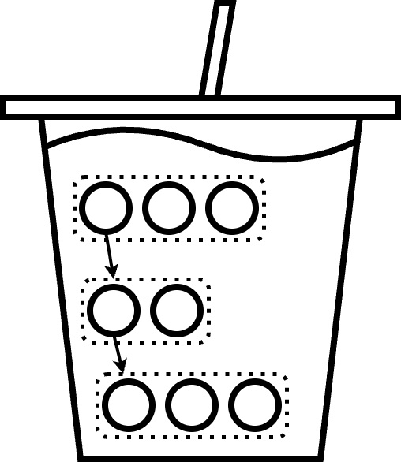

<!--- SPDX-License-Identifier: Apache-2.0  -->
<!--   -->
 SmoothE: Differentiable E-Graph Extraction
==============================================================================

## 📙 Overview

SmoothE is a novel approach for e-graph extraction that handles complex cost models through a probabilistic perspective.
By relaxing the original discrete optimization problem into a continuous differentiable form,
SmoothE minimizes the expected cost via gradient descent to optimize the probability distribution utilizing GPUs.

For a deep dive into the methodology, please refer to our paper: [SmoothE: Differentiable E-Graph Extraction](https://www.csl.cornell.edu/~zhiruz/pdfs/smoothe-asplos2025.pdf)

🚀 **Optimized Implementation**
> Note: This repository contains an optimized implementation of SmoothE, distinct from the original [ASPLOS'25 artifact version](https://github.com/yaohuicai/smoothe-artifact).

Key improvements in this version include:
* **Enhanced GPU Efficiency**: Significant speedups and improved GPU memory usage, especially for large graphs.
* **Improved Algorithm**: Improved stability and convergence of the SmoothE algorithm.
* **Usability**: Includes an automated launch script with hyper-parameter tuning for solving an entire benchmark.


## 🔥 Installation 
### Prerequisites
**Hardware**
To achieve optimal performance, high-end GPU hardware is required.
* Recommended: NVIDIA A100 or newer.
* Minimum: A CUDA-capable GPU with significant VRAM.

### Environment Setup
We recommend using Conda to manage dependencies.

1. Clone the repository:
```bash
git clone https://github.com/Egg-Mind/SmoothE.git
cd smoothe
```

2. Create and activate the environment:
```bash
conda env create -f env.yaml
conda activate smoothe
```

3. Install additional dependencies (if needed):
```bash
pip install "numpy<2" scipy networkx tqdm
```

### Important Notes

⚠️ **CUDA Requirements**: This implementation requires PyTorch with CUDA support. The `env.yaml` specifies PyTorch 2.0.1 with CUDA 11.7. Ensure your system has a compatible NVIDIA GPU and drivers.

⚠️ **Environment Activation**: Always activate the `smoothe` environment before running the scripts:
```bash
conda activate smoothe
```

⚠️ **NumPy Version**: The code requires NumPy 1.x (not 2.x) for compatibility with PyTorch extensions. If you encounter NumPy-related errors, downgrade using:
```bash
pip install "numpy<2"
```

### Verifying Installation

To verify your installation is correct, run:
```bash
python -c "import torch; import torch_sparse; print(f'PyTorch: {torch.__version__}'); print(f'CUDA available: {torch.cuda.is_available()}')"
```

You should see PyTorch version 2.0.1 (or compatible) and `CUDA available: True`.

## 🏁 Quick Start

### Running a Benchmark

This library includes a launch script (`script/solve_benchmark.py`) that automatically optimizes all instances in a benchmark directory.

**Basic Usage:**
```bash
python script/solve_benchmark.py ${PATH_TO_BENCHMARK}
```

**Arguments:**
* `${PATH_TO_BENCHMARK}`: Path to the directory containing benchmark `.json` files
* `--time_limit`: Maximum runtime per instance in seconds (Default: 120)
* `--method`: Solver method: `smoothe`, `cbc`, `scip`, or `cplex` (Default: `smoothe`)

**Example:**
```bash
python script/solve_benchmark.py dataset/tensat --time_limit 60
```

### What Happens During Execution

The benchmark script performs two phases:

**Phase 1: Hyperparameter Search** (~2 minutes for small datasets)
1. Selects the median-sized file from the benchmark directory as representative
2. Tests 4 hyperparameter combinations (2 assumptions × 2 sample frequencies)
3. Each combination runs for up to 30 seconds
4. Identifies the best-performing configuration
   - *Note: Currently, the script uses fixed hyperparameters (`hybrid` assumption, `sample_freq=1`) regardless of search results*

**Phase 2: Full Benchmark Optimization**
1. Processes all `.json` files in the benchmark directory sequentially
2. For each instance:
   - Loads the e-graph from JSON
   - Runs SmoothE optimization using GPU-accelerated gradient descent
   - Respects the `--time_limit` constraint per instance
   - Records the minimum cost and convergence time
3. Saves detailed logs for each instance

**Expected Runtime:**
- Hyperparameter search: ~2 minutes (4 combinations × 30s)
- Per instance: Up to `--time_limit` seconds
- Total for `dataset/tensat` (5 instances with `--time_limit 60`): ~7 minutes

### Output Files

Results are saved to the `logs/` directory:

**Summary Results:**
- `logs/${PATH_TO_BENCHMARK}_result.json`: Contains final results for all instances
  ```json
  {
    "instance1.json": {
      "inference_loss": [...],
      "time": [...],
      "loss": [...]
    }
  }
  ```

**Detailed Training Logs:**
- `logs/smoothe_log/${INSTANCE}_smoothe.json`: Per-instance training details including:
  - Loss trajectory over training steps
  - Inference loss at each evaluation point
  - Time stamps
  - Final solution (selected e-nodes)

### Monitoring Progress

The script prints real-time progress to stdout:
```
Selected dataset/tensat/bert.json for hyper-parameter search
Trying assumption: independent, sample_freq: 1
Trying assumption: independent, sample_freq: 10
...
running on vgg.json
File: vgg.json, Min Loss: 1234.56, Time: 45.2
...
All logs saved to logs/dataset_tensat_result.json
```

### Troubleshooting

**CUDA Out of Memory:**
- The script automatically reduces batch size and retries upon CUDA memory errors
- If problems persist, try smaller benchmark instances first

**No results (all None):**
- Check that you activated the `smoothe` conda environment
- Verify CUDA is available: `python -c "import torch; print(torch.cuda.is_available())"`
- Check logs in `logs/smoothe_log/` for detailed error messages

<!-- dataset/set: 996738, 104632
dataset/maxsat: 3851, 3781
dataset/circuits: 109885, 47817
dataset/herbie: 51525, 9274
dataset/rover/box: 12537, 2852
dataset/rover/fir: 13037, 1604
dataset/rover/mcm: 16960, 2694
dataset/flexc: 19830, 4892
dataset/esyn: 32022, 15102
dataset/tensat: 57800, 34800
dataset/diospyros: 15384, 1671
dataset/impress: 102030, 90312
dataset/boole/mapped: 303327, 154812
dataset/boole/nonmapped: 416269, 163586
dataset/emorphic: 190310, 146160 -->
## 💿 Dataset
This repository also includes an extensive benchmark dataset for testing.
The sources and statistics of the dataset are as follows:
| Benchmark | # Instances | # E-nodes | # E-classes |
|:---|:---|:---|:---|
| [rover/box](https://ieeexplore.ieee.org/abstract/document/10579443/) | 3 | 12,537 | 2,852 |
| [rover/fir](https://ieeexplore.ieee.org/abstract/document/10579443/) | 4 | 13,037 | 1,604 |
| [rover/mcm](https://ieeexplore.ieee.org/abstract/document/10579443/) | 2 | 16,960 | 2,694 |
| [flexc](https://arxiv.org/abs/2309.091121) | 14 | 19,830 | 4,892 |
| [tensat](https://proceedings.mlsys.org/paper_files/paper/2021/hash/cc427d934a7f6c0663e5923f49eba531-Abstract.html) | 5 | 57,800 | 34,800 |
| [diospyros](https://dl.acm.org/doi/abs/10.1145/3445814.3446707) | 10 | 15,384 | 1,671 |
| [impress](https://ieeexplore.ieee.org/abstract/document/9786123) | 3 | 102,030 | 90,312 |
| [set](https://dl.acm.org/doi/10.1145/3669940.3707262) | 4 | 996,738 | 104,632 |
| [maxsat](https://dl.acm.org/doi/10.1145/3669940.3707262) | 6 | 3,851 | 3,781 |
| [herbie](https://dl.acm.org/doi/10.1145/2737924.2737959) | 18 | 51,525 | 9,274 |
| [circuits](https://ieeexplore.ieee.org/document/11168886) | 28 | 109,885 | 47,817 |
| [esyn](https://dl.acm.org/doi/abs/10.1145/3649329.3656246) | 14 | 32,022 | 15,102 |
| [emorphic](https://arxiv.org/abs/2504.11574) | 9 | 190,310 | 146,160 |
| [boole/mapped](https://ieeexplore.ieee.org/stamp/stamp.jsp?arnumber=11132728) | 4 | 303,327 | 154,812 |
| [boole/nonmapped](https://ieeexplore.ieee.org/stamp/stamp.jsp?arnumber=11132728) | 6 | 416,269 | 163,586 |

Note that only a subset of the [*boole*](https://ieeexplore.ieee.org/stamp/stamp.jsp?arnumber=11132728) benchmark is included in this repository due to the GitHub file size limit.
The complete dataset can be downloaded from their [Hugging Face page](https://huggingface.co/datasets/SeaSkysz/eboost_dataset/tree/main/boole).

## 🤼 Comparing with SOTA 
With this optimized implementation, SmoothE achieves the state-of-the-art results.
Comparing with state-of-the-art extraction method, [*e-boost*](https://arxiv.org/abs/2508.13020) using ILP, 
SmoothE is comparable or even better, including on their own benchmarks.
For example, on *boole* and *e-morphic* benchmarks, SmoothE outperforms *e-boost* with CPLEX by 7.8% and 1.7% respectively in terms of geometric mean cost reduction, under the same time limit of 60 seconds per instance.

Note that *e-boost* can also be seen as an orthogonal technique to SmoothE.
By feeding the e-graphs pruned using *e-boost* into SmoothE,
sometimes results can be further improved, especially for large e-graphs.

## 📜 Citation 
If you use SmoothE in your research, please cite our ASPLOS '25 paper:
```
@inproceedings{cai2025smoothe,
  title={Smoothe: Differentiable e-graph extraction},
  author={Cai, Yaohui and Yang, Kaixin and Deng, Chenhui and Yu, Cunxi and Zhang, Zhiru},
  booktitle={International Conference on Architectural Support for Programming Languages and Operating Systems (ASPLOS)},
  pages={1020--1034},
  year={2025}
}
```

